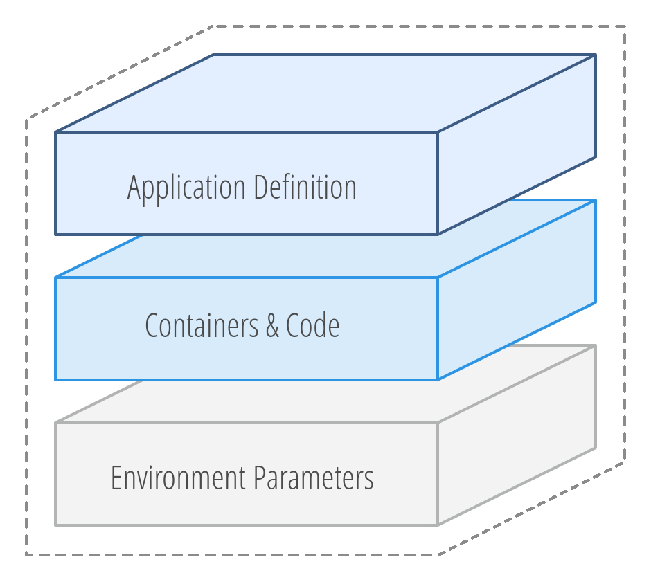

# InAccel Apps

Simplify modern FPGA application development and delivery by bundling
distributed services into a single
[InAccel Docker](https://github.com/inaccel/docker) application.

## What is InAccel Docker?

InAccel Docker is a way to define, package, execute, and manage distributed FPGA
applications and coupled services as a single, immutable object.

Making complex multi-service FPGA applications as easy to build, share and run
as single containers, InAccel Docker helps organizations improve collaboration
across development teams, drives more transparency and consistency in
application development and simplify the tracking and versioning of distributed
FPGA applications.

	

