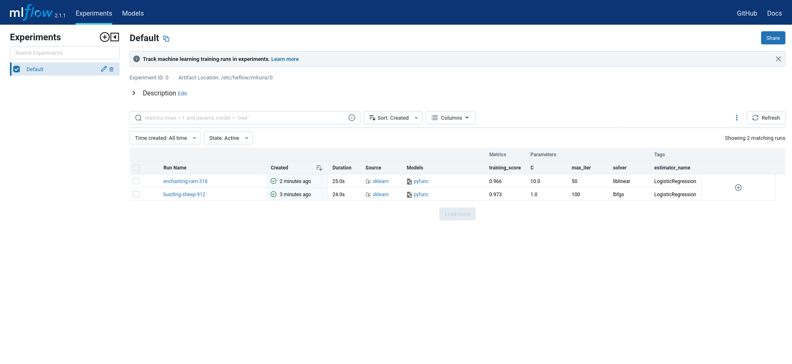
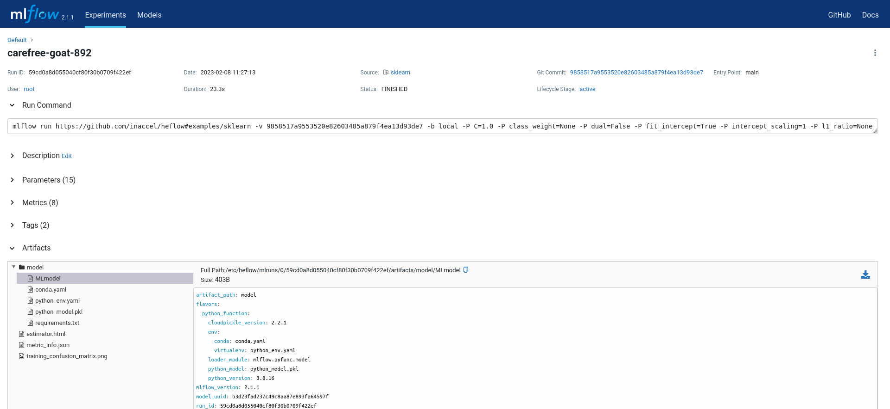

## Train, Encrypt, Serve, and Score a Logistic Regression Model

This tutorial showcases how you can use HEflow Dev end-to-end to:

* Train and encrypt a logistic regression model

* Deploy the encrypted model into a simple gRPC server that will enable you to
score predictions

This tutorial uses a dataset to predict the species of Iris flowers based on
four features: the length and the width of the sepals and petals, in
centimeters. The dataset is from UCI’s
[machine learning repository](https://archive.ics.uci.edu/ml/datasets/iris).

### What You’ll Need

To run this tutorial, you’ll need to:

* Install [Docker](https://docs.docker.com/engine/install)

* Install [Docker InAccel](https://github.com/inaccel/docker). There are two
options for installing this dependency:

	1. Install it manually and manage upgrades manually.

		1. Go to https://github.com/inaccel/docker/releases.

		2. Download the `deb` or`rpm` file for the Docker InAccel package.

			* `inaccel-docker_<version>_amd64.deb`

			* `inaccel-docker-<version>-1.x86_64.rpm`

		3. Install the `.deb` or`.rpm` package.

			* `sudo apt install ./inaccel-docker_<version>_amd64.deb`

			* `sudo yum install ./inaccel-docker-<version>-1.x86_64.rpm`

	2. Set up and install Docker InAccel from
	[InAccel’s repository](https://setup.inaccel.com).

		1. InAccel provides a convenience script to setup InAccel repository
		non-interactively:

			`curl -sS https://setup.inaccel.com/repository | sh`

		2. Install Docker InAccel.

			* `sudo apt install inaccel-docker`

			* `sudo yum install inaccel-docker`

### Training and Encrypting the Model

First, train and encrypt a logistic regression model that takes three
hyperparameters: `C`, `solver` and `max_iter`.

The code is located at
[`examples/sklearn/train.py`](https://github.com/inaccel/heflow/blob/master/examples/sklearn/train.py)
and is reproduced below.

```python
import click
import heflow.sklearn
import mlflow.sklearn
import sklearn.datasets
import sklearn.linear_model
import sklearn.metrics
import sklearn.model_selection


@click.command(context_settings={
    'allow_extra_args': True,
    'ignore_unknown_options': True
})
@click.option('--C', default=1.0)
@click.option('--solver', default='lbfgs')
@click.option('--max-iter', default=100)
def train(c, solver, max_iter):
    X, y = sklearn.datasets.fetch_openml('iris', return_X_y=True)

    X_train, X_test, y_train, y_test = sklearn.model_selection.train_test_split(
        X, y, test_size=3, random_state=42)

    mlflow.sklearn.autolog(log_models=False)

    with mlflow.start_run():
        lr = sklearn.linear_model.LogisticRegression(C=c,
                                                     solver=solver,
                                                     max_iter=max_iter)

        model = lr.fit(X_train, y_train)

        predictions = model.predict(X_test)

        print('predictions=%s' % predictions)

        print('accuracy=%.3f' %
              sklearn.metrics.accuracy_score(y_test, predictions))

        heflow.sklearn.log_model(model)


if __name__ == '__main__':
    train()
```

This example uses the familiar sklearn APIs to create a simple machine learning
model. The MLflow tracking APIs log information about each training run, like
the hyperparameters `C`, `solver` and `max_iter`, used to train the model and
metrics, like the accuracy, used to evaluate the model. The example also
encrypts the model with HEflow and serializes it in a format that MLflow knows
how to deploy.

You can run the example with default hyperparameters as follows:

```sh
docker inaccel -p inaccel/heflow-dev run project https://github.com/inaccel/heflow#examples/sklearn
```

> **Tip**: You can set environment variables for various `docker inaccel`
options. For example, the `INACCEL_PROJECT_NAME` environment variable relates to
the `-p` flag.

Try out some other values for `C`, `solver` and `max_iter` by passing them as
arguments to `train.py`:

```sh
docker inaccel -p inaccel/heflow-dev run project https://github.com/inaccel/heflow#examples/sklearn -- \
	-P C=10.0 -P solver=liblinear -P max_iter=50
```

Each time you run the example, MLflow logs information about your experiment
runs.

### Comparing the Models

Next, use the MLflow UI, at http://localhost:5000, to compare the models that
you have produced.

On this page, you can see a list of experiment runs with metrics you can use to
compare the models.



You can use the search feature to quickly filter out many models.

### Serving the Model

Now that you have identified the best model, it is time to deploy the model
using [MLflow Models](https://mlflow.org/docs/latest/models.html). An MLflow
Model is a standard format for packaging machine learning models that can be
used in a variety of downstream tools — for example, real-time serving through a
gRPC API.

In the example training code, after training the logistic regression model, a
function in HEflow encrypted and MLflow saved the model as an artifact within
the run.

```python
heflow.sklearn.log_model(model)
```

To view this artifact, you can use the UI again. When you click a run name in
the list of experiment runs you’ll see this page.



At the bottom, you can see that the call to `heflow.sklearn.log_model` produced
two files. The first file, `MLmodel`, is a metadata file that tells MLflow how
to load the model. The second file, `python_model.pkl`, is a serialized version
of the encrypted logistic regression model that you trained.

In this example, you can use this MLmodel format with MLflow to deploy a local
gRPC server that can serve predictions.

To deploy the server, run (replace `<Run ID>` with your model’s actual run id):

```sh
docker inaccel -p inaccel/heflow-dev run model runs:/<Run ID>/model
```

Once you have deployed the server, you can pass it some sample data and see the
predictions.

Open an interactive HEflow Dev Python shell to run the example:

```sh
docker inaccel -p inaccel/heflow-dev run shell
```

The code snippet below demonstrates how to use HEflow to load the encrypted
model, connect it to the model server and make predictions.

```python
import grpc
import heflow
import sklearn.datasets
import sklearn.metrics
import sklearn.model_selection

X, y = sklearn.datasets.fetch_openml('iris', return_X_y=True)

_, X_test, _, y_test = sklearn.model_selection.train_test_split(
    X, y, test_size=3, random_state=42)

model = heflow.load_model('runs:/<Run ID>/model').connect(
    grpc.insecure_channel('localhost:8080',
                          (('grpc.max_receive_message_length', -1),
                           ('grpc.max_send_message_length', -1))))

predictions = model.he_predict(X_test)

print('predictions=%s' % predictions)
print('accuracy=%.3f' % sklearn.metrics.accuracy_score(y_test, predictions))
```

The server should respond with output similar to:

```
predictions=['Iris-versicolor' 'Iris-setosa' 'Iris-virginica']
accuracy=1.000
```
